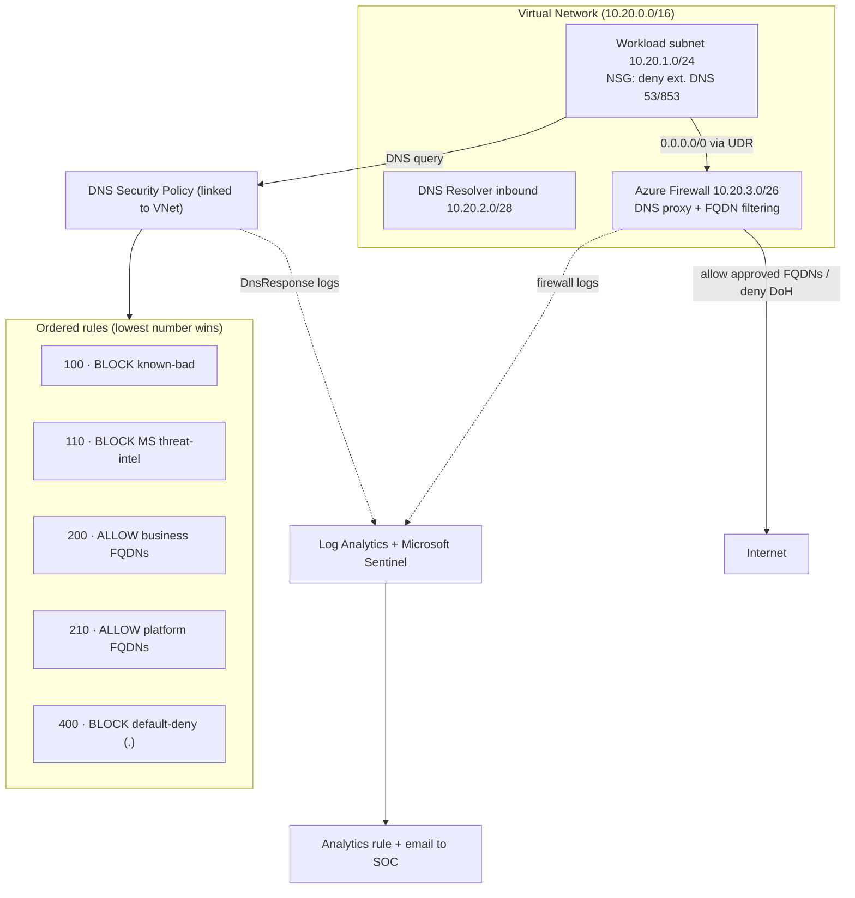

# Architecture

## Overview

This example deploys a hardened Azure network centered on an **Azure DNS
Security Policy**, with layered egress controls so DNS information leakage
(exfiltration / tunneling) cannot simply bypass the policy. It also adds
detection, alerting, and governance guardrails.

## Diagram

## Rule evaluation order (hardened)

Rules evaluate by **priority — lowest number wins**. Malicious domains are
blocked **before** any allow rule, so an allow-listed-by-mistake or compromised
domain still cannot resolve if it is known-bad.

| Priority | Action | Target | Purpose |
|----------|--------|--------|---------|
| 100 | Block | Block-list | Deny known exfil / C2 / tunneling domains |
| 110 | Block | MS-managed threat-intel | Deny emerging malicious domains (was Alert) |
| 200 | Allow | Business allow-list (narrow FQDNs) | Permit approved app domains |
| 210 | Allow | Platform allow-list | Keep Azure control-plane/agents working |
| 400 | Block | Wildcard `.` | Default-deny everything else |

## Gap mitigations mapped

| Gap (from assessment) | Mitigation in this design |
|-----------------------|---------------------------|
| Bypass via external resolver (53/853) | NSG **denies** outbound 53/853 to Internet; firewall network rule denies too |
| DoH to public resolvers on 443 | Firewall app rules **allow only approved HTTPS FQDNs** + explicit DoH deny |
| Broad allow-list abused for exfil | Allow-list tightened to **specific FQDNs**; no `*.windows.net` parents |
| Threat-intel only alerting | TI rule changed to **Block** |
| Allowed domains skip inspection | Block/TI rules ordered **before** allow rules |
| Detection without response | **Sentinel** onboarding + analytics rule + **email alert** on blocked-DNS spikes |
| Tampering (disable/delete rules) | **CanNotDelete lock** + **Azure Policy** audit of disabled rules |
| Local state, no CI | **Remote state backend** example + **CI** (fmt/validate/tfsec/checkov) |
| Short retention | Log retention default raised to **90 days** |
| Default-deny breaks platform | Dedicated **platform allow-list** for Azure FQDNs |

## Components

| Resource | Provider | Purpose |
|----------|----------|---------|
| Resource Group / VNet / subnets | azurerm | Network foundation |
| NSG (workload) | azurerm | Block direct external DNS (bypass prevention) |
| Route table (UDR) | azurerm | Force egress through firewall |
| Azure Firewall + policy | azurerm | Egress FQDN filtering, DoH block, DNS proxy |
| Private DNS Resolver + inbound endpoint | azurerm | Hybrid/custom resolution path |
| DNS Security Policy / domain lists / rules / vnet link | azapi | Core DNS filtering control |
| Log Analytics + diagnostics | azurerm | DNS + firewall logging |
| Sentinel onboarding + analytics rule | azurerm | Detection |
| Action group + scheduled query alert | azurerm | Email response |
| Management lock + Azure Policy | azurerm | Tamper resistance / governance |
