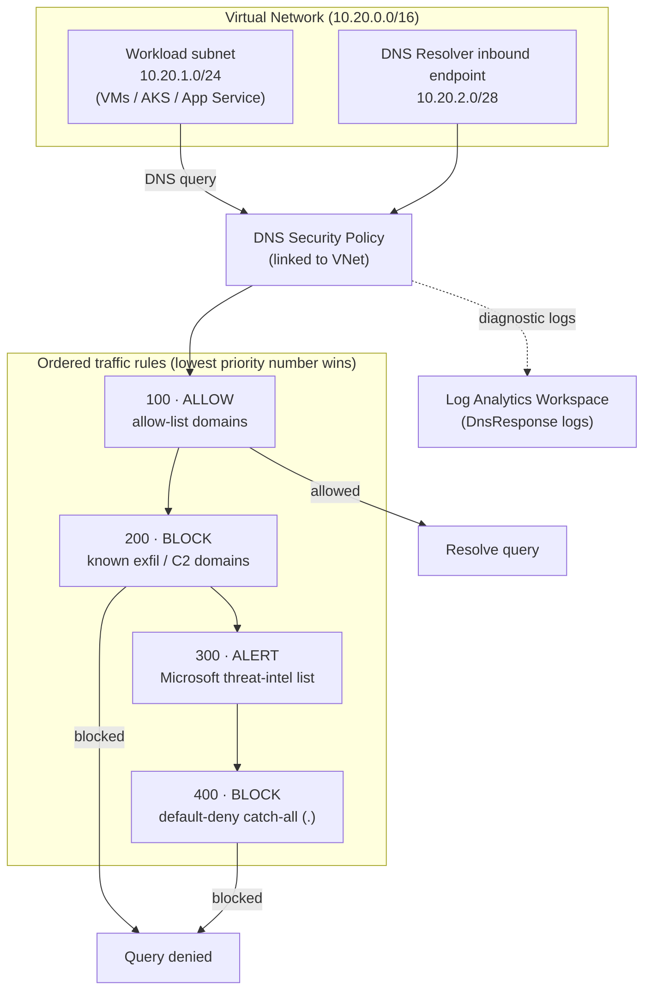

# Architecture

## Overview

This example deploys an Azure network with an **Azure DNS Security Policy**
attached to the virtual network. Every DNS query originating from workloads in
the VNet is evaluated against ordered traffic rules before resolution,
preventing DNS-based information leakage (exfiltration and tunneling) and
providing full query visibility through logging.

## Diagram

## Rule evaluation order

Rules are evaluated by **priority**, where the **lowest number has the highest
precedence**. This implements a default-deny (allow-list) posture:

| Priority | Action | Target | Purpose |
|----------|--------|--------|---------|
| 100 | Allow | Allow-list domain list | Permit approved business domains |
| 200 | Block | Block-list domain list | Explicitly deny known exfil / C2 / tunneling domains |
| 300 | Alert | Microsoft-managed threat-intel list | Log (don't block yet) on emerging malicious domains |
| 400 | Block | Wildcard `.` (all) | Default-deny — anything not allowed above is blocked |

## How it prevents DNS information leakage

1. **Default-deny** stops queries to arbitrary attacker-controlled domains,
   which is how DNS tunneling/exfiltration reaches its destination.
2. **Block-list + threat intel** covers known-bad and emerging domains.
3. **Alert mode** lets you observe impact before enforcing.
4. **Logging to Log Analytics** exposes exfiltration signals (long random
   subdomains, TXT/NULL records, high query volume). See
   [`hunting-queries.md`](./hunting-queries.md).

## Components

| Resource | Provider | Purpose |
|----------|----------|---------|
| Resource Group | azurerm | Container for all resources |
| Virtual Network + subnets | azurerm | Protected network + delegated resolver subnet |
| Private DNS Resolver + inbound endpoint | azurerm | Resolution path for hybrid/custom forwarding |
| DNS Security Policy | azapi | Top-level policy linked to the VNet |
| DNS Resolver Domain Lists | azapi | Allow / block / catch-all domain lists |
| DNS Security Rules | azapi | Ordered Allow / Block / Alert rules |
| VNet Link | azapi | Binds the policy to the VNet |
| Log Analytics Workspace + Diagnostic Setting | azurerm | DNS query logging |
